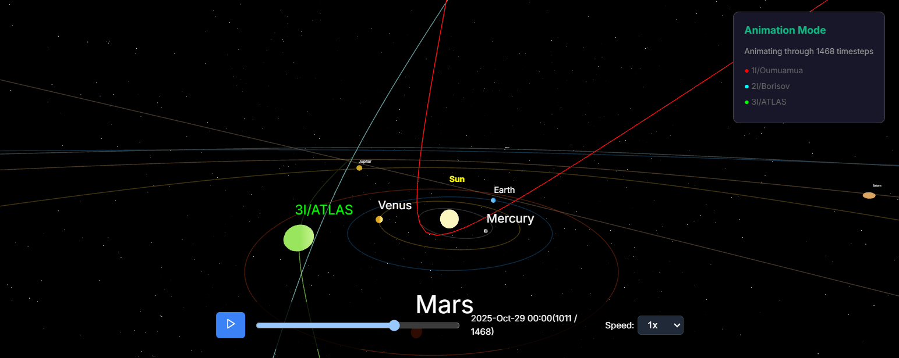
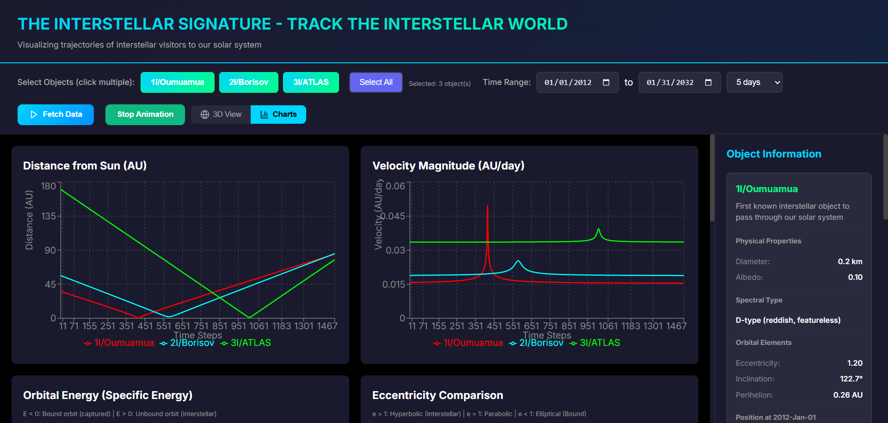

## Summary
**Interstellar Signature** serves as a bridge between raw, unstructured astronomical data and an intuitive, developer-friendly interface. This framework integrates live astronomical data from public repositories and APIs with physics-based simulation techniques to model and visualize the motion of both solar system and interstellar objects in real time. The platform provides interactive visualizations, comparative analysis of interstellar and solar system objects, and modular tools that allow users to explore, modify, and extend the framework for their own research purposes.

## Statement of Need
Interstellar objects, such as 1I/‘Oumuamua and 2I/Borisov, offer a unique window into the formation and evolution of other star systems, yet tracking and analyzing their trajectories remains largely restricted to specialized institutions. Interstellar and solar system datasets are often large, complex, and difficult to navigate, limiting their usability for developers, researchers, and enthusiasts. To address this, we present The Interstellar Signature: A Computational Framework for Open-Source Interstellar Tracking, implemented through a web-based platform.

## Features
- Interactive 3D visualization of solar system and interstellar object trajectories  
- Real-time data integration from public APIs (MPC, JPL Horizons)  
- Modular tools for extension and customization by developers  
- GUI-based interface; no command-line interaction required  
- Part of the **NexusCosmos** ecosystem for space science education and research

## Future work
Future extensions will incorporate AI-driven modules for trajectory prediction, anomaly detection, and enhanced visualization. By combining open-source accessibility, computational rigor, and interactive simulation, Interstellar Signature democratizes interstellar tracking, making advanced space research available to a broader scientific and educational community. This framework represents a step toward bridging professional astronomical research and public engagement through technology.

## Installation

Clone the repository:

```bash
git clone https://github.com/TheVishalKumar369/3I_ATLAS.git
cd 3I_ATLAS
```

Install the backend dependencies

```bash
pip install -r requirements.txt
```

Install the frontend dependencies

```bash
cd frontend
npm install
cd ..
```

Run the backend server

```bash
uvicorn main:app --reload
```

Run the frontend server

```bash
cd frontend
npm run dev
```


*Figure 1: Perihelion positions of interstellar object 3I/ATLAS simulated in The Interstellar Signature.*


*Figure 2: Comparison of velocities and distance of interstellar objects.*

Interstellar object data is sourced from the Minor Planet Center [@mpc2025] and JPL Horizons [@jpl2025].  
The backend is implemented in Python [@python2025] using FastAPI [@fastapi2025], and the frontend uses Three.js [@threejs2025] for 3D visualization.  
The software leverages datasets from the Planetary Data System [@pds2025] and Gaia Archive [@esa2025], and visualization tools such as NASA Eyes [@nasaeyes2025], Celestia [@celestia2025], and SpaceEngine [@spaceengine2025].

